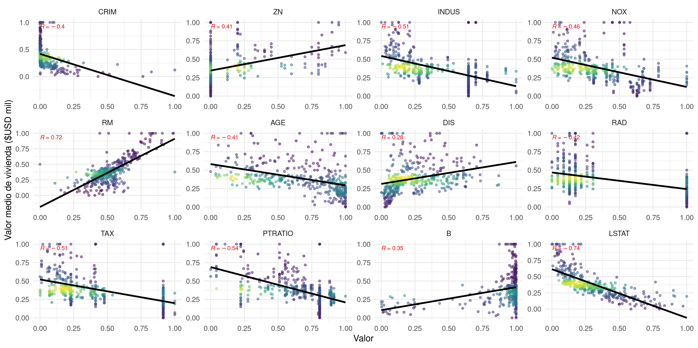

# Data Mining Project - Boston Housing Predictors
## About the Boston Housing dataset
Derived from information collected by the U.S. Census Service concerning housing in the area of [Boston MA](http://www.cs.toronto.edu/~delve/data/boston/bostonDetail.html). The following describes the dataset columns:

- CRIM - per capita crime rate by town
- ZN - proportion of residential land zoned for lots over 25,000 sq.ft.
- INDUS - proportion of non-retail business acres per town.
- CHAS - Charles River dummy variable (1 if tract bounds river; 0 otherwise)
- NOX - nitric oxides concentration (parts per 10 million)
- RM - average number of rooms per dwelling
- AGE - proportion of owner-occupied units built prior to 1940
- DIS - weighted distances to five Boston employment centres
- RAD - index of accessibility to radial highways
- TAX - full-value property-tax rate per $10,000
- PTRATIO - pupil-teacher ratio by town
- B - 1000(Bk - 0.63)^2 where Bk is the proportion of blacks by town
- LSTAT - % lower status of the population
- MEDV - Median value of owner-occupied homes in $1000's

## Statistical analysis
In order to examine and evaluate the workflow under consideration, the [Orange](https://orangedatamining.com/) software was employed as a testing tool, allowing for a comprehensive assessment of its efficacy. 

    

Subsequently, the workflow was executed within the R programming environment, compiling pertinent visualizations for exploratory and comparative analysis. 

    
    

By employing this sequential approach, this project aimed to ascertain the applicability and performance of the workflow, thereby facilitating a thorough investigation of the results obtained.